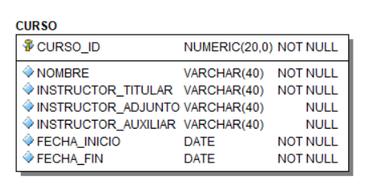

# Tarea 1

**Nombre del alumno:** 

Teniendo el siguiente modelo:




- **Obtener el código para la creación de la tabla:**

  *Copiar el código en el bloque correspondiente*

  ```sql
  
  ```

  *Pegar la captura de pantalla de la creación exitosa del código puesto anteriormente*

  

- **Llenar la tabla con por lo menos 5 Cargas (Es decir 5 datos a cada uno de los campos de la tabla)**

  *Copiar el código en el bloque correspondiente*

  ```sql
  
  ```

  *Pegar la captura de pantalla de la creación exitosa del código puesto anteriormente*

  

- **Modificar la tabla *CURSO* en la columna *NOMBRE* por el nombre *NOMBRE_CURSO***

  *Copiar el código en el bloque correspondiente*

  ```sql
  
  ```

  *Pegar la captura de pantalla de la creación exitosa del código puesto anteriormente*

  

- **Modificar la tabla *CURSO*, para agregar la columna *SEMESTRE*, que debe ser de tipo *VARCHAR2(20)***

  *Copiar el código en el bloque correspondiente*

  ```sql
  
  ```

  *Pegar la captura de pantalla de la creación exitosa del código puesto anteriormente*

  

- **Modificar la tabla *CURSO*, para agregar la columna *Calificación*, que debe ser de tipo *NUMERIC(20)***

  *Copiar el código en el bloque correspondiente*

  ```sql
  
  ```

  *Pegar la captura de pantalla de la creación exitosa del código puesto anteriormente*

  

- **Modificar tabla *CURSO*, para eliminar la columna *FECHA_FIN***

  *Copiar el código en el bloque correspondiente*

  ```sql
  
  ```

  *Pegar la captura de pantalla de la creación exitosa del código puesto anteriormente*

  

- **Modificar la tabla *CURSO* y renombrarla con el nombre *CURSO_INTERSEMESTRAL***

  *Copiar el código en el bloque correspondiente*

  ```sql
  
  ```

  *Pegar la captura de pantalla de la creación exitosa del código puesto anteriormente*

  

- **Actualizar la calificación del  curso cuyo *CURSO_ID* = 1, a *CALIFICACION*=10**

  *Copiar el código en el bloque correspondiente*

  ```sql
  
  ```

  *Pegar la captura de pantalla de la creación exitosa del código puesto anteriormente*

  

- **Actualizar la calificación del  curso cuyo *CURSO_ID* = 2, a *CALIFICACION*=8.5**

  *Copiar el código en el bloque correspondiente*

  ```sql
  
  ```

  *Pegar la captura de pantalla de la creación exitosa del código puesto anteriormente*

