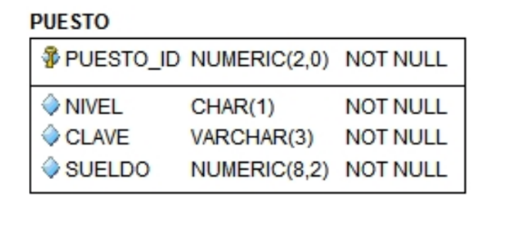

# Tarea 2 (Constraints)

**Nombre del alumno:**

Teniendo el siguiente modelo, hacer lo que se te pide 



- Crear una tabla con las siguientes especificaciones:

- Crear la Primary Key que se solicita

- El nivel del puesto solo debe tener valores 'a', 'b', 'c'

- La clave no debe duplicarse

- El sueldo no debe exceder los 10000

  

  *Poner el código en este recuadro de abajo:*

  ```plsql
  
  ```

  *Poner la captura de pantalla de la creación exitosa de la tabla*